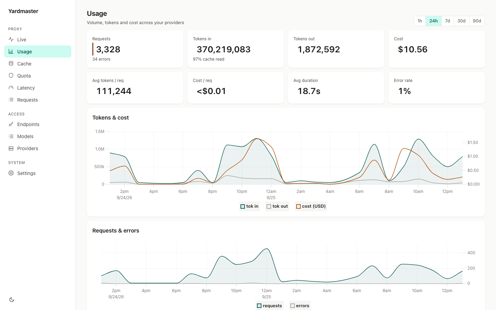
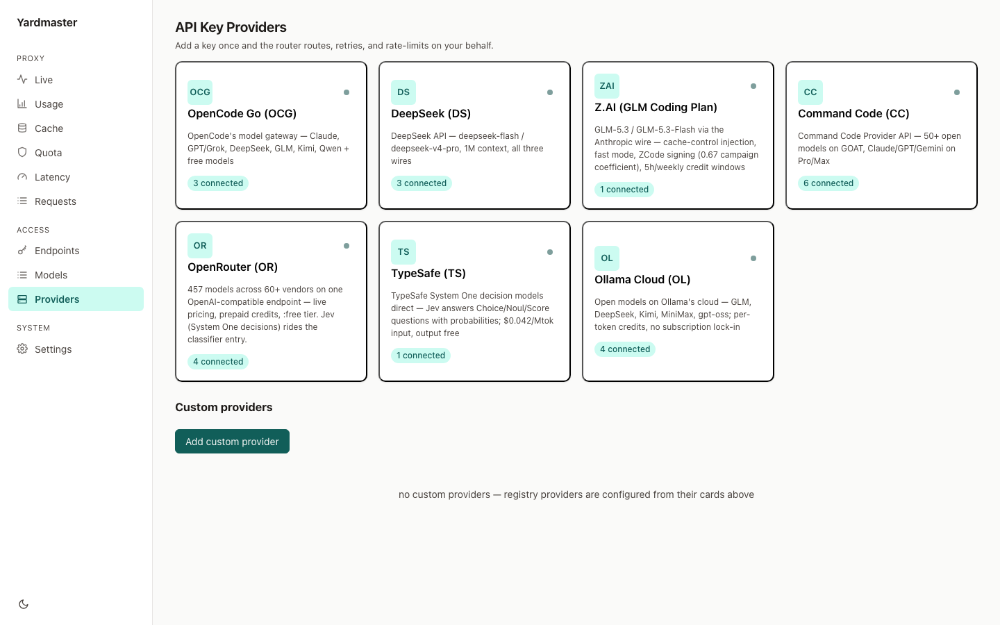

# yardmaster


[](https://github.com/bacnh85/yardmaster/actions/workflows/docker.yml)
[](https://ghcr.io/bacnh85/yardmaster)



**yardmaster** is a self-hosted LLM proxy for CLI coding agents: one API URL
and one key for all your agents, one config entry per upstream provider. Go,
single static binary, embedded dashboard.

It replaces OmniRoute / CLIProxyAPI / 9router with something minimal: no MITM,
no token compression, no OAuth monolith — just fast streaming routing, honest
stats, and isolated auth adapters.

**Why build another proxy?** Existing routers either sit as MITM appliances,
retry blindly across providers, or lock you into their own account model.
yardmaster's design goals are different:

- **Your keys, your config, one YAML file.** Nothing phones home; the dashboard
  and DB live on your machine.
- **Streaming is the product.** Coding agents are long SSE sessions — the
  proxy must be byte-faithful and add ~0 ms TTFT, or it is broken by design.
- **Subscriptions are first-class.** Z.ai GLM Coding, Claude Code, Codex,
  OpenCode Go — pool them behind one OpenAI/Anthropic-compatible endpoint with
  quota visibility, instead of juggling per-CLI logins.
- **Honest stats.** Every request logged to SQLite with TTFT, cache reuse, and
  real cost accounting — not vanity counters.

## Features

- **Streaming-first**: byte-exact SSE passthrough when wires match; flush per
  chunk; client disconnect cancels the upstream call. Bench: **TTFT overhead
  p95 ≤ 1 ms** at 200–500 concurrent streams × 300 tok/s, zero stalls
  (`yardmaster bench`).
- **Wire surface**: `POST /v1/chat/completions` (OpenAI), `POST /v1/messages`
  (Anthropic), and `POST /v1/responses` (OpenAI Responses — pi/codex clients)
  in; OpenAI, Anthropic, or Responses wire per upstream (same-wire requests are
  byte-exact passthrough). Full translation (tool calls, thinking/reasoning,
  usage) between the wires. `GET /v1/models` lists the enriched catalog.
- **Ordered failover**: model → provider chain; any upstream >=400 falls
  through to the next provider/key; the last real upstream error is surfaced.
- **Combos**: one virtual model id pooling the same model across providers —
  `combo/deepseek-v4.1-flash` fans out over OpenCode Go, Command Code, the
  DeepSeek API (per-member upstream ids, pin specific keys/accounts or leave
  all on auto), with priority or weighted-rr dispatch over the existing
  failover/cooldown machinery. Routing analytics (which member served what,
  failover rate, cost split) in the dashboard Combos tab.
- **Z.ai GLM Coding Plan support** (`session`-style providers, see config):
  Anthropic wire, `cache_control` injection (cache reads ≈ 0.1x input — the
  subscription multiplier), fast mode, adaptive thinking, and a per-key
  dispatch throttle that dodges the 429/1302 request-rate limit.
- **OpenCode Go support**: `session: opencode` providers send the required
  `x-opencode-session`/`x-opencode-client` headers (stable per key; a client
  header is forwarded when present), bill the Go subscription at
  `https://opencode.ai/zen/go/v1`, and report live rolling-5h/weekly/monthly
  usage windows in the Quota tab.
- **DeepSeek API support**: all three wires from one key (chat / Anthropic at
  `…/anthropic` / Responses), models `deepseek-flash` (vision) + `deepseek-v4-pro`,
  1M context, cache-hit tokens priced at the cache rate, and the prepaid balance
  in the Quota tab.
- **Provider presets, model catalog & playground**: the dashboard's
  Providers tab ships one-click presets (OpenCode Go, DeepSeek, Z.AI,
  Command Code), pulls each provider's live model catalog (`/models` +
  models.dev enrichment: pricing, context, reasoning/tools, wire family) into
  a checklist, manages multiple API keys ("connections") per provider, and has
  a playground that fires a one-shot test request through the real dispatch
  path on any wire.

  
- **Stats**: SQLite request log (async batched), per-model/provider/key
  breakdowns, TTFT p50/p95, cache hit rate, cost accounting (config-editable
  per-model prices; built-in estimates), live SSE feed, embedded dashboard
  with a dedicated Cache tab (hit rate, token reuse, est. cost saved).

## Quick start

```bash
cp config.example.yaml config.yaml   # fill in provider keys
go build -o yardmaster ./cmd/yardmaster
./yardmaster run -c config.yaml    # http://127.0.0.1:8787
./yardmaster key add my-laptop     # prints a key snippet for config.yaml
```

Dashboard: `http://127.0.0.1:8787/` (admin password from config).
Hot reload: edit `config.yaml` → `SIGHUP` or `POST /admin/api/reload`.

## Docker

```bash
cp config.example.yaml config.yaml   # fill in provider keys
docker compose up -d                 # http://127.0.0.1:8787
```

`docker-compose.yml` mounts `./config.yaml` (read-only) into the container;
state (SQLite DB + WAL) lives in the `yardmaster-data` named volume, owned by
the container's uid 1000 — no host chown needed. Backup:
`docker run --rm -v yardmaster-data:/src -v $PWD:/backup alpine tar czf /backup/yardmaster-data.tgz -C /src .`
Pin a release instead of `latest` with `image: ghcr.io/bacnh85/yardmaster:0.1.0`.
CLI subcommands run without the server:

```bash
docker compose run --rm --entrypoint yardmaster yardmaster key add my-laptop
docker compose run --rm --entrypoint yardmaster yardmaster version
```

Images are published to GHCR (`ghcr.io/bacnh85/yardmaster`) by GitHub Actions
on every push to `main` and every `v*` tag, for `linux/amd64` + `linux/arm64`.

## Provider config

```yaml
providers:
  - name: zai
    base_url: https://api.z.ai/api/anthropic
    wire: anthropic
    auth: { type: static, keys: ["..."] }
    models: [glm-5.3, glm-5.3-flash]
    dispatch_interval_ms: 1000   # per-key spacing (Z.ai 429/1302)
    adaptive_thinking: true      # thinking adaptive + output_config.effort
    inject_cache_control: true   # ephemeral markers on system/tools/last msg
    extra_headers: { anthropic-beta: "fast-mode-2026-02-01" }
    body_overrides: { speed: fast }
    zcode_signing: true          # ZCode desktop parity (Client-Signing V4, fail-open)

routes:
  - match: "glm-*"
    chain: [zai]
  - match: "deepseek-v4-flash"
    chain: [opencode-go, deepseek]   # subscription first, platform fallback
  - match: "deepseek*"
    chain: [deepseek, openrouter]
    strategy: weighted-rr            # spread across mirrors (default: priority)
    weights: [3, 1]                  # index-aligned with chain

# per-provider key handling:
#   rotation: round_robin  — rotate the starting key/account each request
#   (default first = config order)
# cooldowns are automatic: 429 cools provider+key for Retry-After (default
# 30s); 3×5xx in 60s cools 30s. See docs/routing.md for the full model.

keys:
  - { key: "ar-...", name: pi-laptop, allow: ["*"], rpm: 0 }
```

## Routing

Routes match models (exact or `prefix*`) to an ordered provider chain — first
match wins, failover walks the chain on retryable errors. A global default
(`routing.strategy` / `routing.rotation`) is inherited by every route and
provider; per-route `strategy:`/`weights:` and per-provider `rotation:`
override it. Cooldowns after 429/5xx are automatic. See
[docs/routing.md](docs/routing.md) for the research behind these choices.

## OAuth subscription upstreams

Providers backed by a **CLI subscription login** instead of an API key. Import
the CLI's local credentials, then paste the printed YAML into a provider's
`auth:` block:

```bash
yardmaster oauth import claude-code   # ~/.claude/.credentials.json → kind: claude-code
yardmaster oauth import codex         # ~/.codex/auth.json             → kind: codex
yardmaster oauth import opencode      # opencode auth store            → kind: opencode
```

```yaml
providers:
  - name: claude-sub
    base_url: https://api.anthropic.com        # OAuth bearer on the anthropic wire
    wire: anthropic
    auth:
      type: oauth
      oauth_accounts:
        - name: claude-main
          kind: claude-code
          refresh_token: ...
    models: [claude-sonnet-5, claude-opus-5]

  - name: codex-sub
    base_url: https://chatgpt.com/backend-api/codex   # responses wire + account-id header
    wire: responses                                   # translated to openai/anthropic clients
    auth:
      type: oauth
      oauth_accounts:
        - name: codex-main
          kind: codex
          refresh_token: ...
          account_id: ...
    models: [gpt-5.5]

routes:
  - match: "claude-*"
    chain: [claude-sub, zen-claude, cmdcode-claude]   # subscription first, API-key fallback
```

How it works:

- **Pool**: tokens refresh single-flight per account, pre-refreshed before
  expiry, and rotated refresh tokens persist to SQLite (`oauth_tokens`, chmod
  600 DB). Config `access_token`/`expires_at` are only seeds.
- **Cooldown & rotation**: upstream 429/403 quota errors cool an account down
  (exponential, max 10 min); the failover loop skips cooled accounts and tries
  the next account/provider. 401 forces a re-refresh.
- **Adapters are config, not code**: `kind` picks baked-in endpoints/client-ids
  for `claude-code` and `codex`; any other account sets `token_endpoint` +
  `client_id` directly (opencode's endpoints aren't publicly documented yet).
- Dashboard → Providers shows each account's state (seed / ok / cooldown /
  error).

> ToS note: wrapping CLI subscriptions violates some providers' terms. Internal
> use only.

## Per-CLI setup (all against `http://127.0.0.1:8787`, key `ar-...`)

| CLI | Config |
|---|---|
| **pi** | OpenAI-compatible provider: `base_url: http://127.0.0.1:8787/v1` |
| **Claude Code** | `ANTHROPIC_BASE_URL=http://127.0.0.1:8787 ANTHROPIC_AUTH_TOKEN=ar-...` |
| **Codex** | `~/.codex/config.toml` → `model_providers.ar` with `base_url = "http://127.0.0.1:8787/v1"`, `wire_api = "chat"` |
| **opencode** | provider with OpenAI-compatible base URL `http://127.0.0.1:8787/v1` |
| **Cline / Cursor** | OpenAI-compatible base URL + key |

## Benchmarks

`yardmaster bench -conns 500` — synthetic SSE upstream, N concurrent
streams, measures proxied-vs-direct TTFT:

```
streams=500  wall=2.684s  total-chunks=151500
TTFT direct   p50=3.0ms p95=5.0ms max=7.0ms
TTFT proxied  p50=3.0ms p95=5.0ms max=8.0ms
overhead      p50=0.0ms p95=0.0ms
stalls        0
phase-0 gate (overhead p95 < 5ms, 0 stalls): PASS
```

Real-provider spot checks through the router (2026-09-16): glm-5.3 via Z.ai
Anthropic passthrough ≈143 tok/s; deepseek-v4-flash via OpenCode Go ≈56–80
tok/s × 3 concurrent streams; glm-5.3-flash ≈36–41 tok/s (thinking included).

## Development

```bash
go test ./...                # Go test suite
cd web && npm ci && npx vitest run   # dashboard tests (React + Vite)
go build -o yardmaster ./cmd/yardmaster
```

The dashboard is embedded via `go:embed` — run `cd web && npx vite build`,
then rebuild the binary to see dashboard changes. UI follows the token system
in [DESIGN.md](DESIGN.md).

`AR_ALLOW_ANON_ADMIN=1` starts the dashboard open without login (screenshot /
demo mode) — bind to `127.0.0.1` only if you use it.

## Contributing

PRs are welcome. Small, focused diffs first; big design changes as an issue
first.

- **Go**: run `go test ./...` and `go vet ./...` before submitting; keep new
  provider quirks in config (`extra_headers`, `body_overrides`, presets), not
  hardcoded branches.
- **Dashboard**: `cd web && npx tsc -b && npx vitest run`; follow
  [DESIGN.md](DESIGN.md) tokens — no ad-hoc colors or shadows.
- **New provider preset**: add it to the Providers-tab registry with docs
  (base URL, wire, quota window behavior) and a config example in this README
  or `docs/`.
- **Wire translation changes** (`internal/translate/`): include a
  streaming tool-call round-trip case in the tests — that's where
  translations break.
- **Commits**: conventional style (`feat:`, `fix:`, `docs:`, …) keeps the
  changelog greppable.

## Status

- Phases 0–4 done (core, translation, stats, dashboard, OAuth subscription
  pools: claude-code + codex adapters, responses-wire translation, account
  cooldown/rotation).
- Deferred: `/v1/responses` serving (client side), Gemini-native wire,
  opencode OAuth endpoints (set `token_endpoint`+`client_id` when documented).

## License

MIT — see [LICENSE](LICENSE).

## Layout

```
cmd/yardmaster/    run | key add | bench
internal/config/     YAML config + validation + cost table
internal/translate/  openai<->anthropic requests/SSE
internal/provider/   registry + model routing
internal/auth/       inbound keys (RPM) + per-key dispatch limiter
internal/proxy/      streaming pipeline, failover, usage tee
internal/store/      SQLite request log + aggregates
internal/server/     endpoints, admin API, dashboard
web/                 React + uPlot dashboard (embedded via go:embed)
bench/               perf harness (also `yardmaster bench`)
```
